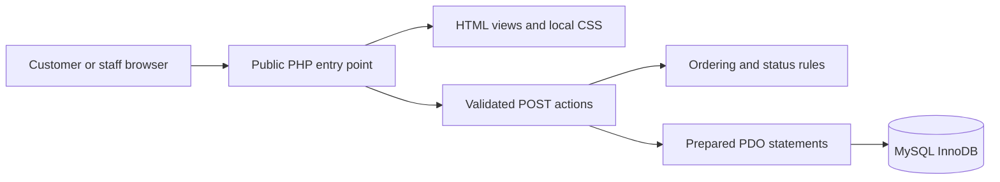
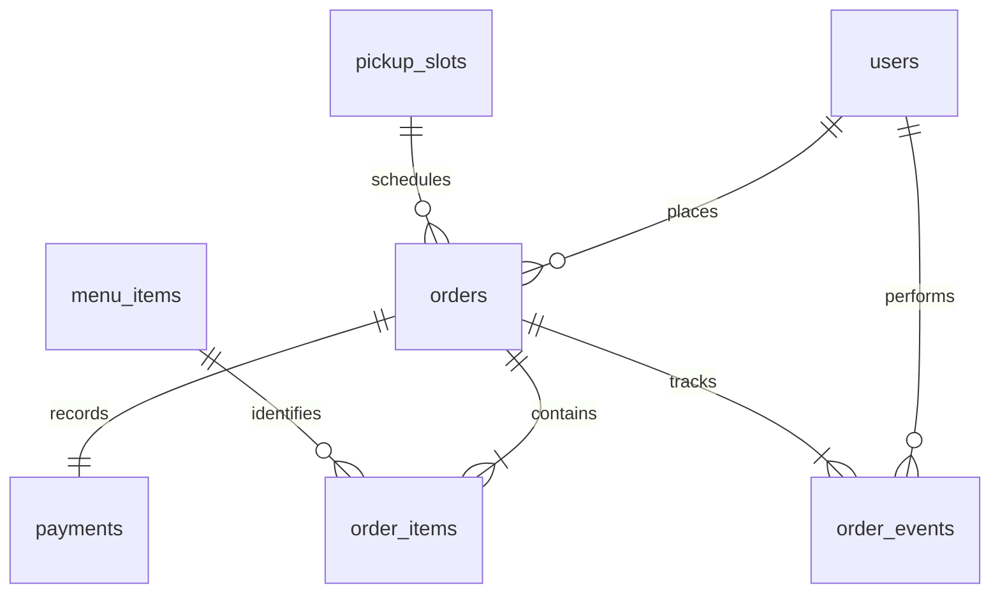

# Design and operating guide

## Scope and architecture

The prototype implements Proposal-1 with the required HTML5, CSS3, JavaScript, PHP and MySQL stack. A server-rendered multi-page interface avoids a separate front-end build. `public/index.php` routes page requests; `app/actions.php` validates customer mutations and delegates staff changes to `app/staff_actions.php`; `app/views.php` renders customer pages and delegates staff pages to `app/staff_views.php`. `app/domain.php` contains quantity, collection-time and status rules. `app/bootstrap.php` supplies sessions, database access and helpers. Only `public/` is web-accessible.

## Data model

`users` stores account identity, a password hash and role. `menu_items` holds the current catalogue. `orders` links an account to a collection slot and snapshots the contact details, total and checkout key. `order_items` preserves item names and unit prices as ordered. `payments` records one simulated payment per order. `order_events` records the actor and time of status changes. `pickup_slots` holds the capacity counter. `login_attempts` persists sign-in throttling across sessions.

Monetary values are integer cents. Catalogue prices are re-read at checkout and compared with the displayed total. PDO prepares values separately from SQL. The order transaction locks the slot and catalogue rows, checks capacity and availability, writes the order/lines/payment/event, increments capacity and commits. Failure rolls the whole transaction back. A unique checkout key prevents successful request replay from creating a second order.

Order transitions are `received → preparing → ready → collected`. Received and preparing orders can be cancelled; cancellation records `simulated_refunded` and releases slot capacity. Ready and collected orders cannot be cancelled through this prototype. Staff should verify handover before marking collected.

## User manual

1. Browse Our menu, choose a category or enter a search term. Sold-out items cannot be added.
2. Expand Make it yours / group order to add the recipient and a preparation note. Add multiple lines to separate people ordering the same item.
3. Open Bag. Update quantities or remove lines. Totals update on the server. Register/sign in before checkout.
4. Enter a collection name and phone number, choose an offered slot, and optionally add a group name and note. Slots use Canberra/Sydney local time and are checked again on submission.
5. Select an approved or declined demonstration payment, acknowledge the simulation, and place the order. No card information is requested. A decline keeps the bag for retry.
6. Read the confirmation and retain the order reference. My orders lists your latest 100 orders. Open an order and use Refresh status to see progress. Only your signed-in account can read your orders.
7. Collect when Ready and show the reference to staff. Sign out on shared devices.

Staff sign in through the same page. The Staff desk shows counts and up to 100 matching orders, ordered by collection time. Filter by status, review group labels/notes, and use Start preparing, Mark ready or Mark collected. Cancellation requires a browser confirmation when JavaScript is enabled, then records a simulated refund. The staff queue is manually refreshed; it does not promise real-time push updates. Manage menu edits existing seeded items. Uncheck Available to order to mark an item sold out.

## Security and privacy

Passwords use PHP `password_hash` and `password_verify`; registration never accepts a staff role. Login rotates the session ID. Cookies are HttpOnly and SameSite=Lax; enable secure cookies over HTTPS. Mutating forms use a session CSRF token. User data is HTML-escaped. Order reads check account ownership; staff actions verify the role on the server. Sign-in allows ten attempts per email in a 15-minute window across sessions.

Only operational account/order data is collected. There are no payment-card fields, marketing trackers or external asset calls. The privacy page explains purpose, session cookies and simulated payment. Customer deletion requires operator handling; no email verification or password reset is implemented. Staff provisioning is CLI-only. Public production use requires HTTPS, real operational contact details, appropriate retention rules, supported runtime patching and a further security review. These are deployment prerequisites, not a claim of legal certification.

## Methodology and design decisions

An iterative approach fits a three-person project: each increment ends with a demonstrable customer or staff outcome and a test. A strict waterfall approach would provide stable upfront documentation but delay feedback on the ordering journey. Unstructured coding would reduce planning overhead but leave integration and ownership unclear. The proposed approach uses short weekly review cycles within an agreed scope and fixed Week 12 delivery.

Plain PHP and server-rendered forms directly match the brief and run without a JavaScript build pipeline. A SPA framework would support richer client interactions but add dependencies and duplicate routing/state concerns. MySQL-compatible MariaDB fits the required relational data and transactional ordering; local browser storage alone would not protect staff access or preserve shared orders. XAMPP is the default local environment. The setup command provisions a database-scoped account, seeds the menu and links only `public/` into Apache's document folder. Docker remains an optional repeatable environment. JavaScript enhances confirmation and duplicate-click handling; server validation remains authoritative.

## Risk register

| Risk | Likelihood / impact | Control | Owner |
|---|---|---|---|
| Database unavailable | Medium / high | Generic error page; inspect server logs; database backup and restore rehearsal | Mandip Rijal |
| Duplicate or partial orders | Medium / high | Unique checkout key, one database transaction, rollback and replay tests | Mandip Rijal |
| Collection overload | Medium / medium | Locked slot counters; eight orders per slot; reject full slots | Mandip Rijal |
| Unauthorised access | Medium / high | Role and ownership checks, hashed passwords, CSRF tokens, prepared statements | All members |
| Allergy misunderstanding | Medium / high | Menu allergen text, shared-kitchen notice and direct discussion with staff | Jasson |
| Scope expansion | High / medium | Keep real payments, delivery and advanced inventory out of assessment scope | Jasson |
| Installation failure | Medium / high | SQL/setup scripts, no front-end build, documented clean install | Rudesh |
| Missing contribution evidence | Medium / high | Record real issue/commit links and weekly decisions; preserve actual timestamps | All members |

## Service management

The operator checks the database and a sample page before service, reviews pending orders during opening hours, and verifies the collection queue before closing. Local assessment target: restore a failed demonstration within one hour using the latest daily backup; this is a proposed target, not a measured SLA. A public release needs a separately agreed availability target.

Back up with `mysqldump --single-transaction --no-tablespaces -h 127.0.0.1 -u cafe_app -p cafe_portal > backup.sql` (use an interactive command prompt or a backup tool that preserves UTF-8). Keep backups outside `public/`, restrict access and test recovery into a separate database. On Windows PowerShell 5, prefer `mysqldump --result-file=backup.sql` to avoid output re-encoding. For restore, use MySQL's `source /absolute/path/backup.sql` from its interactive client. Never restore over active data without an explicit recovery decision and a current backup.

Incident priorities: failed ordering or exposed private data is urgent; a single unavailable product is normal; cosmetic defects are low. Record symptom, time, affected order references, owner and fix. If checkout fails, customers first check My orders before retrying. Inspect private PHP/MySQL logs; do not show stack traces or credentials in the UI. Restore service, rerun a smoke order, then record the cause and prevention action.

## Change management

Record each change as an issue with purpose, user impact, acceptance criteria and owner. Assess database, security and timetable effects. Develop on a branch, request a teammate review and run relevant tests. Back up before schema changes. Merge only after acceptance evidence is recorded. Keep deployable releases tagged and preserve real Git authorship/timestamps. Revert an application change using a reviewed Git revert; database rollback may require a separate migration or restore because reverting code does not undo data changes.

## Week 12 demonstration outline

Jasson introduces the busy-café problem, navigates the menu on mobile and prepares a labelled group bag. Mandip explains account protection and demonstrates a declined payment followed by approved checkout, then shows the stored receipt and slot logic. Rudesh demonstrates the staff queue, prepares and completes the order, and shows test evidence, installation and operational handover. Finish by explaining simulated payments and the prototype boundaries. Target 8–10 minutes and allocate comparable speaking time.

## Sources

- Supplied ICT312 Assignment 02 brief: required stack, group size, weekly progress, working system, Word documentation and individual reflection.
- Supplied Proposal-1: café click-and-collect scope, group ordering, simulated payments and security intentions.
- [PHP password hashing manual](https://www.php.net/manual/en/function.password-hash.php): password hash API.
- [PHP prepared statements manual](https://www.php.net/manual/en/pdo.prepared-statements.php): prepared PDO statements.
- [MySQL locking reads](https://dev.mysql.com/doc/refman/8.4/en/innodb-locking-reads.html): transactional row locking.
